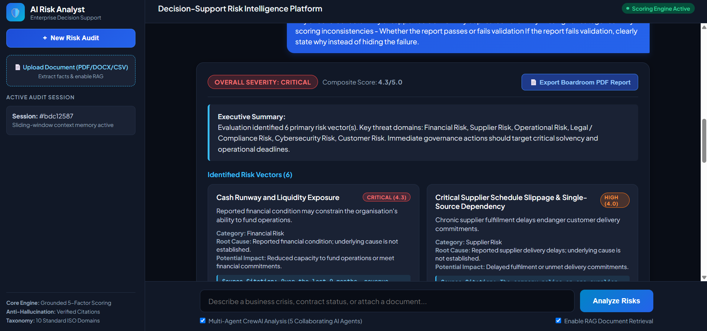
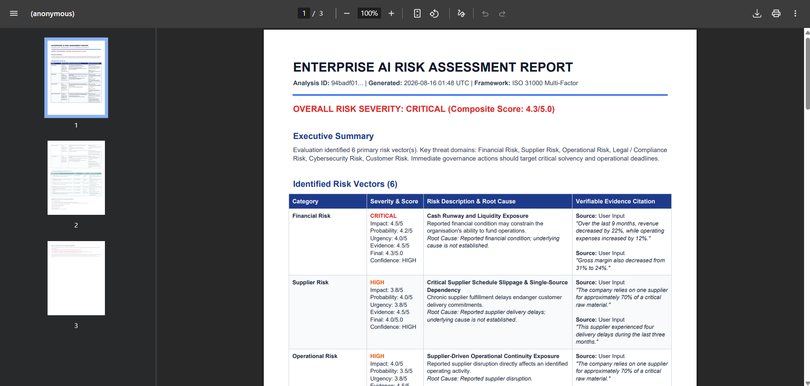

# AI Risk Analyst

An evidence-first risk-analysis platform for turning business situations and uploaded documents into traceable risk reports. It combines FastAPI, deterministic scoring, optional OpenAI/OpenRouter reasoning, hybrid document retrieval, and a React dashboard.



## Why this project

Risk analysis should not turn every sentence into a risk or hide weak coverage behind a perfect score. This project uses an explicit quality pipeline:

```text
User input / documents
  → Fact extraction
  → Fact validation and materiality
  → Risk detection
  → Risk deduplication
  → Deterministic scoring
  → Risk interdependencies
  → Mitigation mapping
  → Missing-information analysis
  → Final quality control
  → Report
```

Each risk must have verifiable evidence and a Fact ID. Final QC calculates real coverage:

`linked important facts / important validated facts`

For example, `15 / 20 = 75%` is **not valid**. It is returned as `REANALYSIS_REQUIRED`. A report is `VALID` only when coverage is at least 90% and all citation, Fact-ID, action, and mapping checks pass. Invalid reports cannot be exported as PDF or sent to n8n.

## Features

- Explicit facts with stable IDs (`F-001`, `F-002`, …)
- Evidence-backed risks across ten enterprise risk domains
- Deterministic severity formula: impact 35%, probability 25%, urgency 25%, evidence quality 15%
- Fact-to-risk coverage, missing Fact IDs, invalid citations, and missing actions checked at QC
- Optional RAG over PDF, DOCX, TXT, and CSV uploads
- Prompt-injection redaction and basic PII masking
- Conflict detection for key financial statements
- Board-style PDF reports and optional n8n dispatch
- React dashboard and FastAPI OpenAPI docs

## Screenshots

| Risk dashboard | PDF report |
| --- | --- |
|  |  |

## Stack

- Backend: Python, FastAPI, Pydantic, SQLAlchemy scaffolding
- AI: OpenAI/OpenRouter optional; deterministic rule-engine fallback
- Retrieval: in-memory hierarchical hybrid RAG
- Frontend: React + TypeScript
- Reporting: ReportLab
- Testing: pytest
- Deployment: Docker Compose

## Run locally

```powershell
python -m venv .venv
.\.venv\Scripts\Activate.ps1
pip install -r requirements.txt
uvicorn app.main:app --reload --port 8001
```

Open <http://localhost:8001/docs> for the API documentation, or <http://localhost:8001/app> for the bundled UI.

To run the standalone React client:

```powershell
cd frontend
npm install
npm start
```

## Test

```powershell
.\.venv\Scripts\python.exe -m pytest -q
```

The suite includes a QC failure scenario proving that three linked facts out of four produces 75% coverage and `REANALYSIS_REQUIRED`.

## API at a glance

| Endpoint | Purpose |
| --- | --- |
| `POST /api/v1/analyze` | Analyze a business situation. |
| `POST /api/v1/chat` | Analyze within an in-memory conversation. |
| `POST /api/v1/documents/upload` | Upload and index a document. |
| `POST /api/v1/documents/query` | Query indexed document chunks. |
| `POST /api/v1/reports/pdf` | Export a QC-valid report. |
| `POST /api/v1/reports/n8n-trigger` | Dispatch a QC-valid report to n8n. |

## Project structure

```text
app/          # FastAPI core, services, routes, and schemas
frontend/     # React dashboard
tests/        # pytest suite
docs/         # architecture, methodology, screenshots, detailed reference
evaluation/   # offline evaluation dataset and runner
n8n/          # workflow export
```

For an implementation-level, file-by-file guide, see [Project Reference](docs/PROJECT_REFERENCE.md).

## Configuration

Copy `.env.example` to `.env` and set an `OPENAI_API_KEY` or `OPENROUTER_API_KEY` if you want LLM-assisted analysis. Without a key, the deterministic rule engine remains available.

Never commit `.env`, uploads, audit logs, virtual environments, caches, or frontend dependencies. They are excluded by `.gitignore`.
