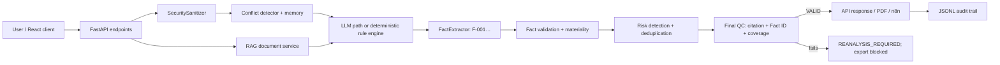

# AI Risk Analyst — Implementation and Architecture Reference

This is the implementation-level README for the repository. It describes the code that runs today, not a planned architecture. Generated folders (`.venv`, `__pycache__`, `.pytest_cache`, `.pnpm-store`) and runtime data (`data/uploads`, `data/audit/audit_trail.jsonl`) are intentionally not documented file-by-file because they are created or changed while the application runs.

## What the system does

The project is a FastAPI risk-analysis service with a small React chat client. A user can submit a situation, optionally retrieve relevant text from uploaded files, and receive risks, deterministic scores, actions, source citations, extracted facts, and a final validation decision. It uses OpenAI/OpenRouter when configured, otherwise a deterministic rule engine. The rule engine is also the safety fallback if the LLM output is malformed or fails grounding checks.

The important contract is now:

1. Every explicit input/document statement becomes an extracted fact with a stable `F-###` ID.
2. Fact validation verifies that facts are explicit and source-backed, then identifies important facts using deterministic domain/metric materiality rules. Fact validation does not create risks.
3. Risk detection works only from the validated facts/input signals. Every reported risk has one or more source citations, and every citation must carry a valid Fact ID.
4. The final QC gate calculates coverage as `important facts linked to detected risks / important facts`. It does not add citations or risks to improve the number. A result with 15 linked facts out of 20 has 75% coverage and is `REANALYSIS_REQUIRED`, not `VALID`.

## Runtime architecture



### Analysis lifecycle

`POST /api/v1/analyze` enters `AIRiskAnalyzerService.analyze_situation`.

1. Input is sanitized: prompt-injection fragments are redacted and PII patterns are masked.
2. Recent in-memory conversation context is obtained. If enabled, hybrid RAG retrieves document chunks; only user input and retrieved excerpts are eligible evidence for a new risk.
3. Conflicts are detected. The system prefers the LLM path when an API key exists; unsupported JSON, numbers, claims, categories, or quotes cause fallback to deterministic rules.
4. `FactExtractor` turns every explicit sentence into `ExtractedFact`. `FactValidator` then verifies source/explicitness and labels important facts without creating a finding.
5. Findings are detected, deduplicated, scored with the deterministic formula, converted into `EvidenceSource` records, and supplied with recommendations.
6. `RiskReportQualityGate` checks verbatim quotations, fact coverage, missing evidence, missing/invalid Fact IDs, missing actions, and action-to-risk mapping. Coverage is the actual count of important facts cited by a detected risk; the gate never manufactures a risk or citation to improve it. The API response advertises `VALID` only when all checks pass.
8. An audit record is appended. PDF and n8n endpoints independently recompute the critical QC checks and reject a response that is not valid for distribution; a client cannot bypass this merely by changing a JSON flag.

### Scoring

The service, not the LLM, calculates severity:

`score = impact × 0.35 + probability × 0.25 + urgency × 0.25 + evidence_quality × 0.15`

Scores are clamped to 1–5. `CRITICAL` is at least 4.2, `HIGH` at least 3.4, `MEDIUM` at least 2.5, otherwise `LOW`. The response uses the highest finding score as the overall score.

## API surface

| Endpoint | Job |
| --- | --- |
| `GET /api/v1/health` | Service status and timestamp. |
| `POST /api/v1/analyze` | Runs a direct risk analysis. |
| `POST /api/v1/chat` | Stores a turn in memory and returns an analysis in a chat message. |
| `GET /api/v1/conversations/{id}` | Reads the in-memory session. |
| `POST /api/v1/documents/upload` | Saves, parses, chunks, and indexes a PDF/DOCX/TXT/CSV document. |
| `POST /api/v1/documents/query` | Searches indexed chunks with hybrid scoring. |
| `POST /api/v1/reports/pdf` | Produces a PDF only for a QC-valid analysis; otherwise returns HTTP 422. |
| `POST /api/v1/reports/n8n-trigger` | Dispatches a QC-valid report to n8n; otherwise returns HTTP 422. |

## Source file reference

### Root and deployment

| File | Code responsibility |
| --- | --- |
| `requirements.txt` | Python dependency set: FastAPI, Pydantic, OpenAI, document parsers, ReportLab, and test tooling. |
| `Dockerfile` | Builds the backend image, installs requirements, and starts Uvicorn. |
| `docker-compose.yml` | Starts the backend with PostgreSQL, Qdrant, and n8n service definitions/environment wiring. |
| `.env.example` | Safe template for ports, model keys, database/Qdrant, and n8n configuration. Never copy secrets into tracked files. |
| `.gitignore` | Excludes secrets, bytecode, environments, generated uploads/audit files, and frontend build outputs. |
| `pytest.ini` | Pytest discovery/configuration. |
| `README.md` | Product overview, deployment instructions, methodology overview, and pointer to this detailed reference. |

### Application bootstrap and configuration

| File | Code responsibility |
| --- | --- |
| `app/__init__.py` | Marks the backend application package. |
| `app/config.py` | Defines the cached Pydantic `Settings` object, reads `.env`, and exposes `settings` for all runtime configuration. |
| `app/main.py` | Application factory; configures FastAPI, permissive development CORS, global error response, API router mounting, and static UI serving. |
| `app/api/__init__.py` | Marks the API package. |
| `app/api/v1/__init__.py` | Marks the versioned API package. |
| `app/api/v1/router.py` | Composes health, analysis, chat, document, and report endpoint routers under `/api/v1`. |

### Core assurance layer

| File | Code responsibility |
| --- | --- |
| `app/core/__init__.py` | Marks the core package. |
| `app/core/facts.py` | Defines immutable `ExtractedFact` and `FactExtractor`. It splits supplied text into explicit statements, assigns stable Fact IDs, classifies known business metrics/categories, extracts simple values/units/timeframes, and never infers facts from risks. |
| `app/core/fact_validation.py` | Defines `FactValidator` and its result. It validates explicit, source-backed facts and determines which facts are important enough to participate in the coverage denominator; it never detects or creates risks. |
| `app/core/quality.py` | Defines `RiskReportQualityGate`: normalization, quote verification, duplicate removal, known-vs-unknown reconciliation, owner/claim checks, fact coverage, Fact ID existence checks, and structural report warnings. |
| `app/core/methodology.py` | Implements deterministic severity/confidence scoring, contradiction detection for runway/revenue/metric conflicts, and category/dedupe-key risk-chain consolidation. |
| `app/core/security.py` | Masks email, phone, payment-card, and IBAN values; redacts common injection patterns; appends compact JSONL audit records. |
| `app/core/memory.py` | Provides an in-process conversation store with a ten-message prompt window. It is intentionally non-persistent MVP storage. |

### Schemas and storage scaffolding

| File | Code responsibility |
| --- | --- |
| `app/schemas/__init__.py` | Marks the schema package. |
| `app/schemas/risk.py` | Pydantic API contract for risks, evidence, facts, actions, dependencies, validation, request, and response. `ReportValidation` owns `status`, `valid_for_distribution`, coverage, and Fact-ID failures. |
| `app/schemas/document.py` | Pydantic models for upload results, hierarchical chunks, and RAG search responses. |
| `app/schemas/chat.py` | Models chat requests, message roles/content, and conversation sessions. |
| `app/db/__init__.py` | Marks the database package. |
| `app/db/session.py` | SQLAlchemy engine/session factory configuration for the optional PostgreSQL persistence layer. |
| `app/db/models.py` | SQLAlchemy ORM tables for persisted documents/risk-analysis data when that layer is enabled. |

### Services

| File | Code responsibility |
| --- | --- |
| `app/services/__init__.py` | Marks the service package. |
| `app/services/risk_analyzer.py` | The orchestration core. Sanitizes input, gathers RAG/memory, selects LLM or rules, validates LLM JSON, builds rule findings, extracts and validates facts, maps evidence to Fact IDs, scores risks, performs final QC, and writes audit events. |
| `app/services/rag_service.py` | In-memory hierarchical RAG. It saves uploads, extracts PDF/DOCX/TXT/CSV sections, chunks by document/page/section/paragraph, then ranks with lexical overlap plus exact-number matching. |
| `app/services/pdf_service.py` | Uses ReportLab to create a report with severity, risks, evidence, actions, uncertainty, and QC status; falls back to UTF-8 text bytes if rendering fails. |
| `app/services/crew_service.py` | Optional CrewAI orchestration façade. It declares five specialist agents/tasks, then delegates the authoritative returned result to the same grounded analyzer. |

### Endpoint implementations

| File | Code responsibility |
| --- | --- |
| `app/api/v1/endpoints/__init__.py` | Marks endpoint package. |
| `app/api/v1/endpoints/health.py` | Returns application health metadata. |
| `app/api/v1/endpoints/analyze.py` | Exposes the direct analysis endpoint. |
| `app/api/v1/endpoints/chat.py` | Handles greeting shortcuts, stores messages, invokes analysis, and returns a structured assistant message. |
| `app/api/v1/endpoints/documents.py` | Enforces the 15 MB upload cap and exposes document indexing/querying. |
| `app/api/v1/endpoints/reports.py` | Generates PDFs and n8n payloads. Both paths use the final distribution gate and return HTTP 422 for invalid reports. |

### Frontend

| File | Code responsibility |
| --- | --- |
| `frontend/package.json` | React build/test scripts and frontend dependencies. |
| `frontend/Dockerfile` | Builds/serves the frontend container. |
| `frontend/public/index.html` | Browser HTML shell for the React bundle. |
| `frontend/src/index.tsx` | React entry point that mounts `App`. |
| `frontend/src/App.tsx` | Chat UI state, API calls, risk/action rendering, and PDF download. It disables export and tells the user to re-analyze if final QC did not approve distribution. |
| `frontend/src/App.css` | Layout, sidebar, cards, badges, and chat visual styling. |
| `frontend/src/types/risk.ts` | TypeScript mirror of the API structures used by the UI, including QC status and Fact-ID failure fields. |
| `app/static/index.html` | Separate static browser UI served directly by the backend for the `/` and `/app` routes. |

### Tests, evaluation, and supporting artifacts

| File | Code responsibility |
| --- | --- |
| `tests/conftest.py` | Shared pytest setup. |
| `tests/test_risk_analyzer.py` | Unit/integration coverage for rule detection, scoring, conflicts, LLM payload rejection, sanitization, evidence grounding, Fact IDs, actual coverage calculation (including 3/4 = 75% failure), and final QC validity. |
| `tests/test_rag.py` | Document ingestion and hybrid RAG behavior tests. |
| `tests/test_pdf.py` | Direct PDF generation plus the API-level invalid-QC export rejection test. |
| `tests/test_chat.py` | Chat endpoint/session behavior tests. |
| `tests/test_health.py` | Health endpoint contract test. |
| `evaluation/dataset.json` | Curated scenarios and expected signals for offline assessment. |
| `evaluation/evaluate.py` | Runs/aggregates evaluation checks against that dataset. |
| `n8n/risk_analysis_workflow.json` | Importable n8n workflow for receiving an analysis payload and automating delivery. |
| `docs/ARCHITECTURE.md` | Earlier high-level architecture notes. |
| `docs/METHODOLOGY.md` | Risk methodology and grounding documentation. |

## Running and verifying

Backend development command:

```powershell
.\.venv\Scripts\python.exe -m uvicorn app.main:app --reload --port 8001
```

Run the tests with the project virtual environment:

```powershell
.\.venv\Scripts\python.exe -m pytest -q
```

For a valid report, inspect `report_validation`: it must show `status: "VALID"`, `valid_for_distribution: true`, no evidence/Fact-ID failures, and coverage of at least 0.90. Any other status means the output remains available for review but cannot be treated as a valid distributable report.
